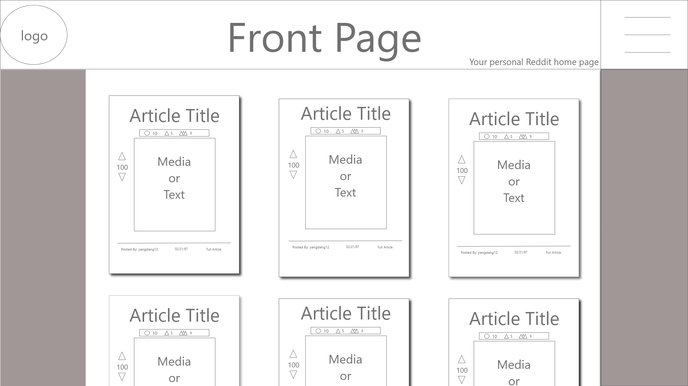
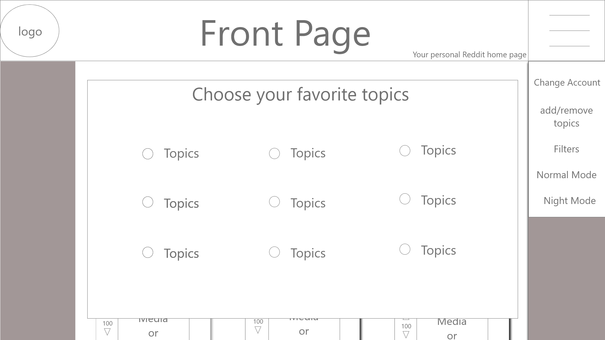
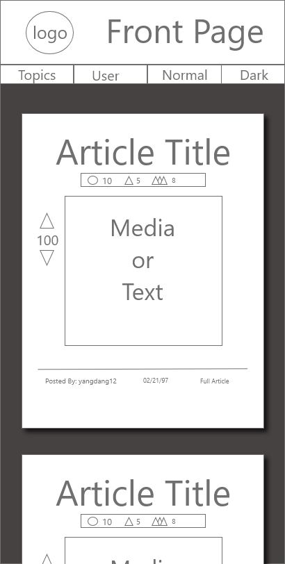
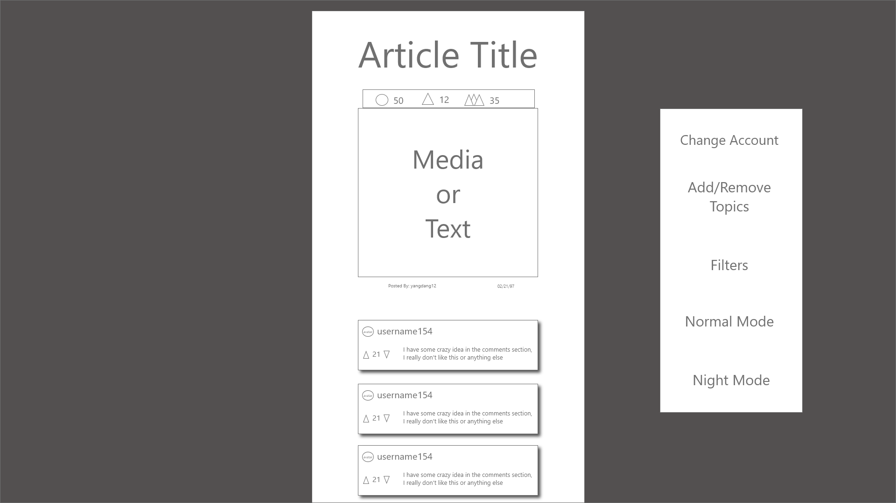
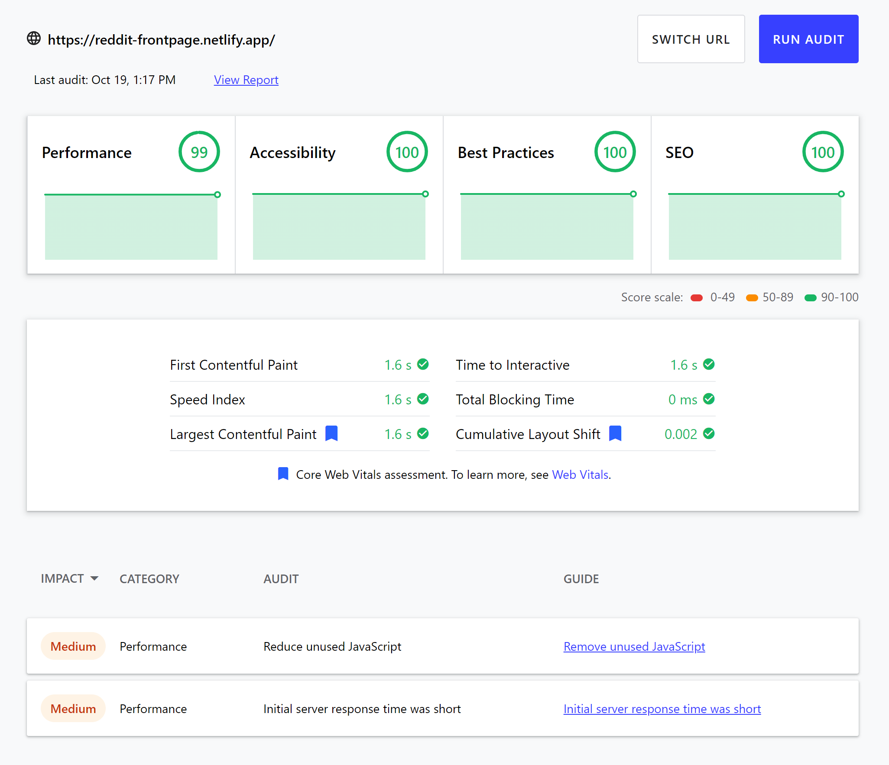

# Front Page
## My Reddit client project

This project is a Reddit homepage that takes user input for topics and displays reddit articles pertaining to that topic. It was 
built using React, React Router, and Redux. Each topic chosen pulls three articles from three diffrent subreddits returning nine artircles related to that topic. As always I appreciate any feedback on the web app, as I am always learning. Thank You!

## Deployment
https://reddit-frontpage.netlify.app/

## Build

The initial render gives you a form that has topic checkboxes to fill out and choose what type of content you want displayed. These topics are then stored in the topics slice. These topics are then paired with the corrisponding subredits and stored in a local state. A thunk is dispatched, using the subreddits to fetch articles from reddit. The order of the articles is then randomized and stored in the articles slice. Once loaded the articles are displayed in a preview form, showing the title, preview, upvotes, awards, and user. There is also a React-Router link that takes the user to a page containing a full version of the article incuding media and comments. This full article is fetched using another dispatch but the article info and comments are stored in a local state. Some settings I included are a night mode toggle for easier reading in the dark and the ability to change the topics you want rendered.

## Future work
I am still working out how to implement testing for components that are using the redux store functions. Once I have that, I will write complete tests for the project.
Some of the future plans for this project are to create a reddit api account and access the full reddit api. This will allow me to search users and display their avatars and flairs on the posts and comments. There will also be a log-in function that allows you to use your own reddit account and load the subreddits that you follow. Another feature to be implemented is a search function that returns articles relating to the search terms.

## Documentation

### Subreddits
This is a list of the topics available and the subbredits that the articles are fetched from:
```javascript
    subredditList = {
        animals: ['cats','NatureIsFuckingLit', 'awww'],
        cars: ['Autos', 'JDM', 'AwesomeCarMods'],
        fashion: ['findfashion', 'sneakermarket', 'streetwearstartup'],
        gaming: ['gaming', 'GamePhysics', 'casualnintendo'],
        humor: ['nottheonion', 'memes', 'FellowKids'],
        news: ['worldnews', 'news', 'UpliftingNews'],
        sports: ['CFB', 'barstoolsports', 'PremierLeague'],
        tech: ['technews', 'technology', 'Futurology'],
        travel: ['EarthPorn','travel','landscapes']
    }
```
### Wireframes
Initial wireframe sketches of the project. *Made on AdobeXD* :

##### Homepage wireframe


##### Homepage with menues open


##### Mobile Homepage


##### Article and comments page



## Lighthouse Scores


